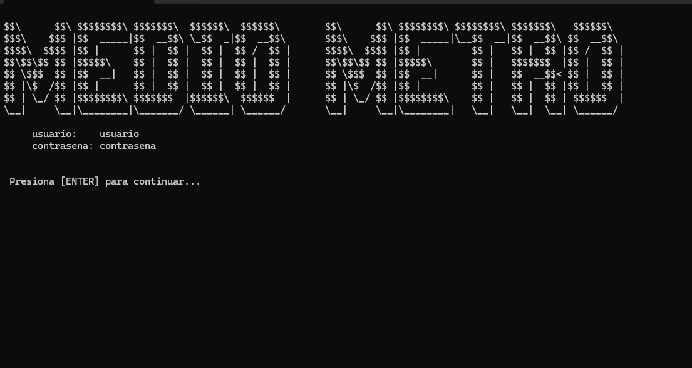

# CENTRO DE LLAMADAS
Poyecto de la materia estructuras de datos.

## DESCRIPCIÓN
Se creó un sistema sobre un centro de llamadas el cual maneja agentes, llamadas y clientes para implementar estructuras de datos.

## Imagenes generadas por el proyecto

### Interfaz

